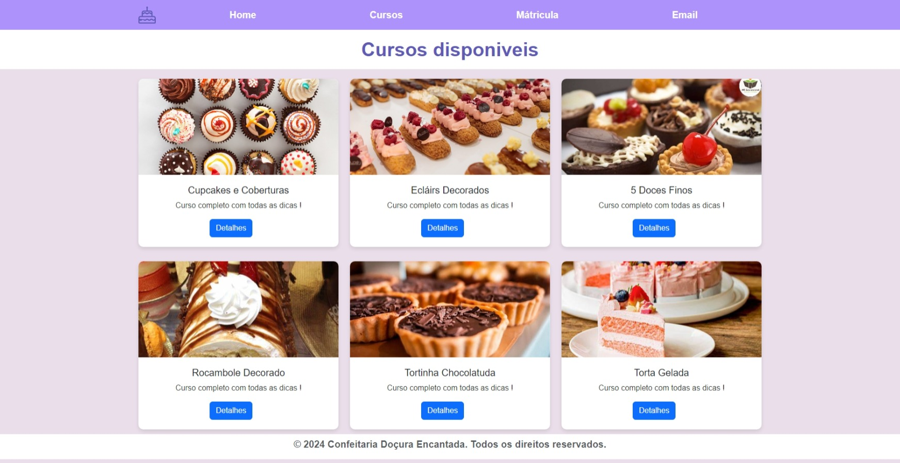

# Projeto-Escola

- Venda de cursos de confeitaria.

## Sobre o Projeto:

- Esse é um projeto onde contem 4 páginas, uma home, cursos, matricula e um modal de contato.

## Linguagens:

- HTML
- CSS
- JavaScript
- Bootstrap

## Como Testar:

- **1.** clone este repositório;
- **2.** Abra com Visual Studio;
- **3.** Abra o index.html;
- **4.** Irá abrir uma tela onde você podera conhecer melhor o app.

## Telas

## Tela Home:

## Tela Cursos:

## Tela Matricula:

## Tela Contato:

